# Dotfiles

Personal Linux desktop configuration built around Niri, Waybar, Rofi, swaync, hyprlock, ly, systemd user services, and a small set of shell scripts. The repository is managed with GNU Stow and keeps generated files out of Git, so the checked-in files remain the source of truth.

The setup is intentionally boring in the places that should be reliable: one compositor, one launcher stack, one theme switcher, one volume path, one wallpaper path.

## Desktop

- **Compositor:** Niri, split into small `cfg/*.kdl` files.
- **Bar:** Waybar with Niri workspaces, VPN state, Wakatime, audio, brightness, battery, language, and notification state.
- **Launcher:** Rofi for apps, clipboard, wallpapers, and theme selection.
- **Notifications:** swaync with compact controls, MPRIS, and click-to-focus for source apps through Niri IPC.
- **Locking:** hyprlock with PAM fingerprint support and password fallback.
- **Idle:** swayidle, calling `hyprlock` and Niri monitor power actions.
- **Display manager:** ly on `tty1`.
- **Wallpaper:** `awww` for images and `mpvpaper` for videos.
- **Themes:** one preset system applies Waybar, Rofi, GTK/libadwaita, Qt/KDE, swaync, hyprlock, and wlogout together.

## Layout

```text
.config/niri/          Niri session, outputs, input, rules, keybinds, autostart
.config/waybar/        Bar config, active theme layers, Wakatime/status scripts
.config/themes/        Unified theme presets and generator
.config/rofi/          Launcher, clipboard, wallpaper, and theme menus
.config/swaync/        Notification center config, CSS template, focus helper
.config/desktop/       Shared scripts for menu, volume, brightness, wallpaper
.config/dotfiles/      Shared helper library and machine-local profile example
.config/hypr/          hyprlock only; Hyprland compositor configs are removed
.config/ly/            TTY display manager config and deploy helper
.config/systemd/user/  Session services started by dotfiles-session.target
.config/xkb/           Custom Russian shortcut-friendly XKB layout
etc/pam.d/hyprlock     PAM config for fingerprint unlock with password fallback
etc/systemd/system/     Root systemd units for hardware/session integration
etc/udev/rules.d/       Udev rules for power-source automation
scripts/               Package lists, setup helpers, doctor, PAM, SSH, DDC/CI
notes/                 Hardware and operational notes
```

## Install

Install packages first:

```sh
~/.dotfiles/scripts/setup
```

The package sets live in `scripts/packages.pacman` and `scripts/packages.aur`.

Stow the files:

```sh
cd ~/.dotfiles
stow --restow --target="$HOME" .
```

Apply privileged pieces when needed:

```sh
sudo ~/.dotfiles/scripts/setup-pam
sudo ~/.dotfiles/scripts/setup-power
sudo ~/.dotfiles/scripts/setup-ddcci
~/.dotfiles/scripts/setup-ssh-agent
~/.dotfiles/scripts/setup-home-dns
~/.dotfiles/scripts/setup-stt
```

Deploy ly config explicitly:

```sh
sudo ~/.config/ly/apply.sh
```

`scripts/setup` also creates editable repo-local files from every `*.example`
template when the matching file without `.example` does not already exist, then
stows them into `$HOME`.

After setup, edit optional per-machine overrides as needed:

```sh
$EDITOR ~/.dotfiles/.config/dotfiles/machine.conf
```

Configure home split DNS after setting the local NetworkManager connection name
in `machine.conf` if it is not `eth`:

```sh
~/.dotfiles/scripts/setup-home-dns
```

This routes `*.home` to the local OPNsense DNS while VPN default DNS (`~.`)
continues to handle public names. It also adds a persistent `10.69.0.0/16`
route through the local gateway so home VLANs bypass full-tunnel VPNs.

Validate a machine after install:

```sh
~/.dotfiles/scripts/doctor
```

Run repository-level tests without touching the real home directory:

```sh
~/.dotfiles/scripts/test
```

## Machine-Local Files

These files are intentionally ignored and should stay outside Git:

```text
~/.gitconfig.local
~/.ssh/config.local
~/.ssh/yubikeys.tsv
~/.config/dotfiles/machine.conf
~/.config/Code/User/settings.json
~/.zshrc.local
```

On a machine that already has local Git or SSH config, move it into the local override files before stowing:

```sh
mv ~/.gitconfig ~/.gitconfig.local
mv ~/.ssh/config ~/.ssh/config.local
cd ~/.dotfiles
stow --restow --target="$HOME" .
```

## Niri

Niri is configured as small, readable files:

```text
.config/niri/config.kdl
.config/niri/cfg/input.kdl
.config/niri/cfg/display.kdl
.config/niri/cfg/layout.kdl
.config/niri/cfg/environment.kdl
.config/niri/cfg/autostart.kdl
.config/niri/cfg/rules.kdl
.config/niri/cfg/keybinds.kdl
```

Useful commands:

```sh
niri validate -c ~/.config/niri/config.kdl
niri msg outputs
niri msg windows
niri msg action load-config-file
```

The laptop panel is fixed at `3072x1920@120.000` with VRR disabled for stable frame pacing. External DP output can keep VRR in `display.kdl`.

## Themes

Themes are flat presets in `.config/themes/*.conf`. Applying a theme generates runtime files for the rest of the desktop. Each preset has `theme_mode=dark` or `theme_mode=light`; this drives GTK/libadwaita `color-scheme`, shell exports, and portal-aware apps such as browsers.

```sh
~/.config/themes/theme-switch list
~/.config/themes/theme-switch current
~/.config/themes/theme-switch apply tokyo-night
~/.config/themes/theme-switch menu
```

Theme previews are captured on an empty Niri workspace with each preset's `bg` color applied as a solid wallpaper.

GTK3 uses the configured `gtk_theme` plus generated `gtk.css`. GTK4/libadwaita apps read the generated `gtk-4.0/gtk.css` and `org.gnome.desktop.interface color-scheme`. GTK surfaces get a subtle automatic tint by blending each theme's `bg`, `muted`, and `accent`; presets can override this with `gtk_surface`, `gtk_sidebar`, and `gtk_header`. Already-running GTK apps may need to be restarted manually to reload generated CSS. Qt apps are themed globally through `QT_QPA_PLATFORMTHEME=qt6ct`, generated `qt5ct`/`qt6ct` palettes, and a small `dotfiles.qss` for menus and popups. Dolphin is the exception: it is launched through `~/.local/bin/dolphin` with the KDE platform theme so it uses KDE's native dark palette instead of Qt stylesheet file-view hacks.

Toolkit styling expects `adw-gtk-theme`, `qt5ct`, `qt6ct`, and `breeze` to be installed. `adw-gtk-theme` provides the GTK theme presets use, `qt5ct`/`qt6ct` load generated Qt palettes, and `breeze` provides KDE/Qt styling for Dolphin.

| Theme | Preview |
| --- | --- |
| `amber-forge` | 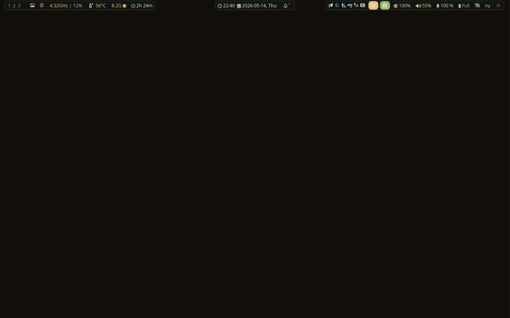 |
| `blood-moon` | 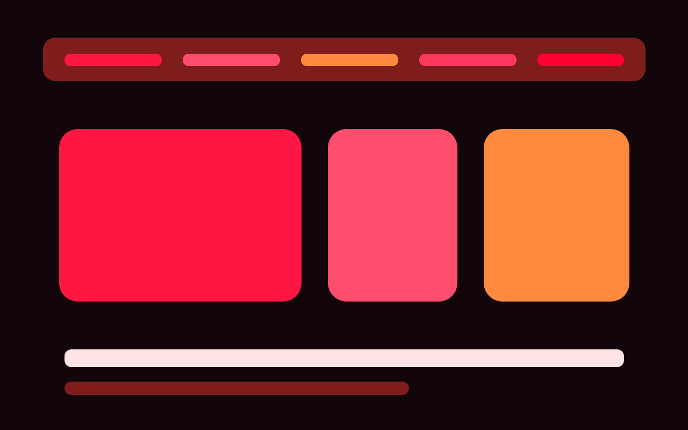 |
| `catppuccin-mocha` |  |
| `cyberpunk` |  |
| `dracula` |  |
| `everforest` | 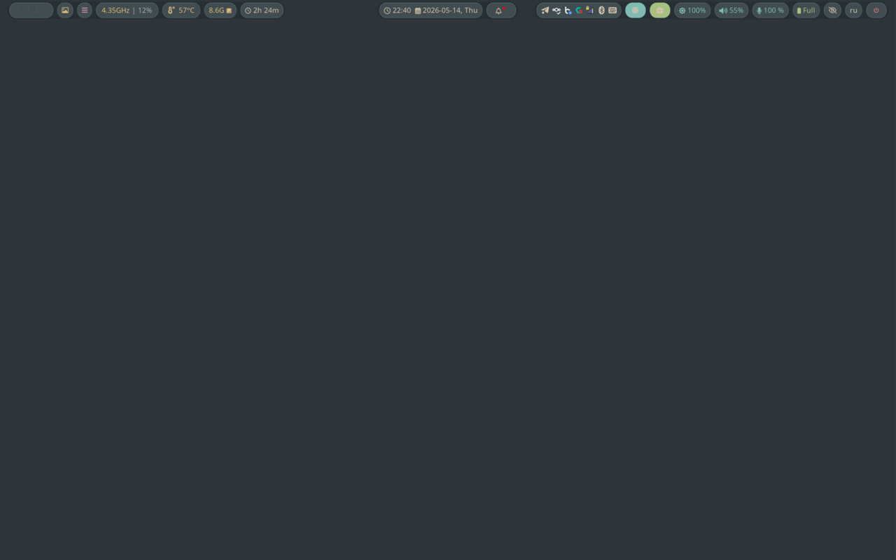 |
| `gruvbox-dark` | 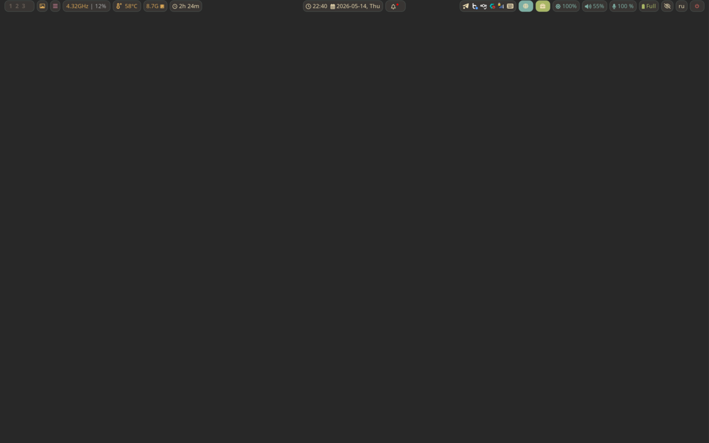 |
| `kanagawa-thin` | 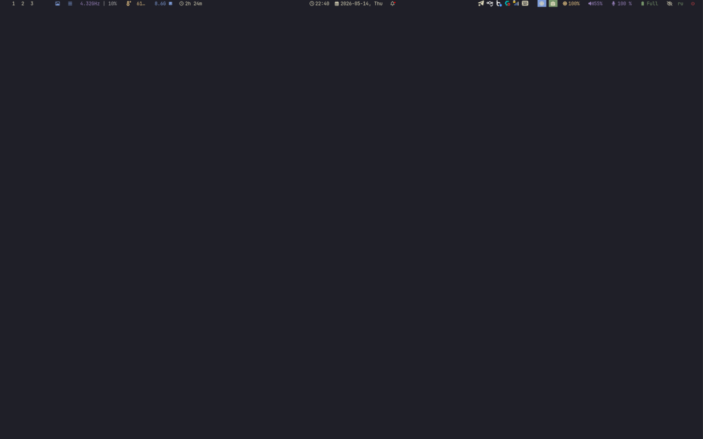 |
| `kanagawa-wave` | 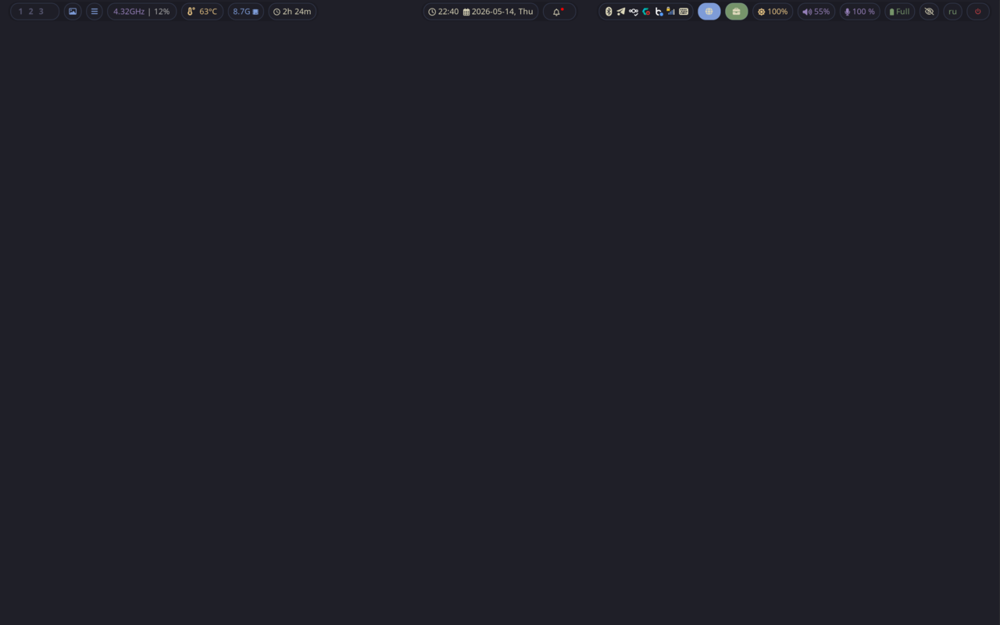 |
| `matte-black` |  |
| `miasma` | 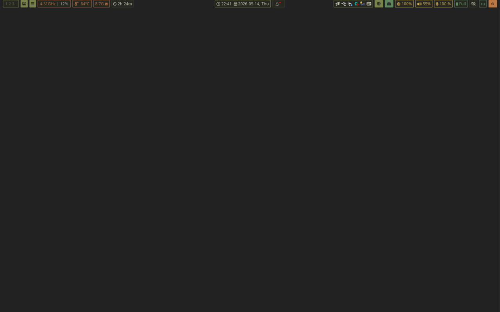 |
| `mono` | 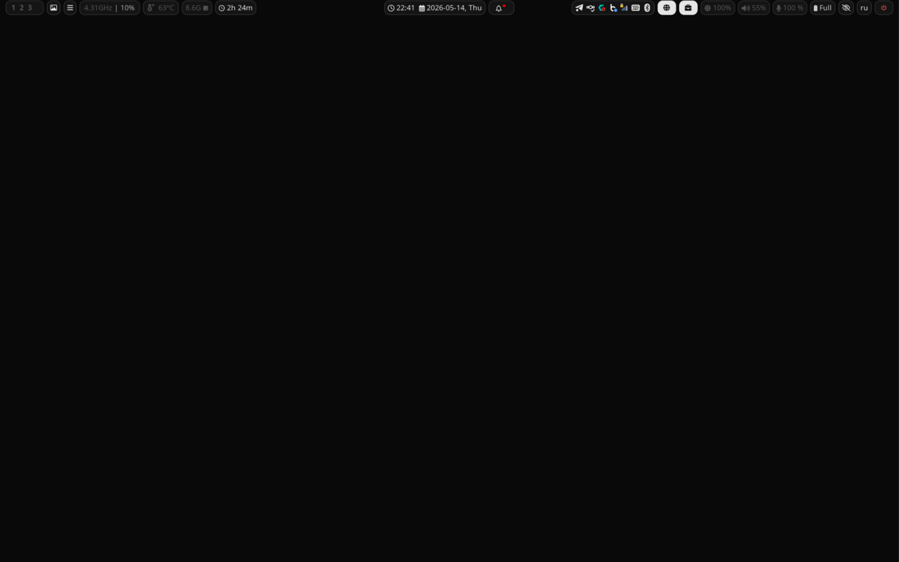 |
| `nord-frost` |  |
| `one-dark` | 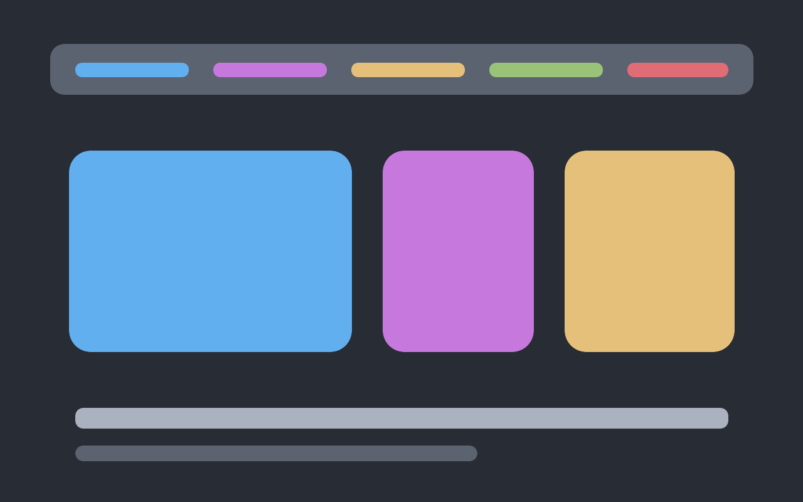 |
| `rose-pine` | 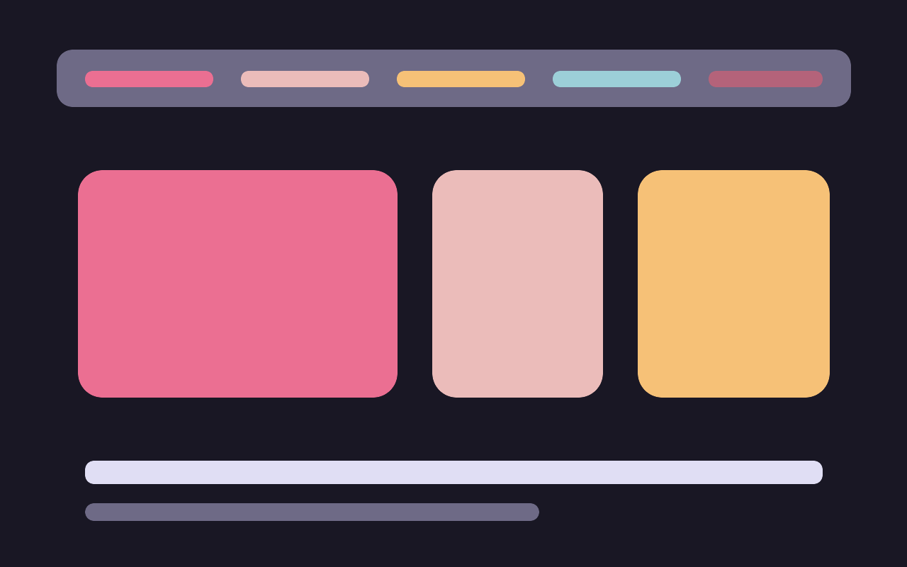 |
| `tokyo-night` | 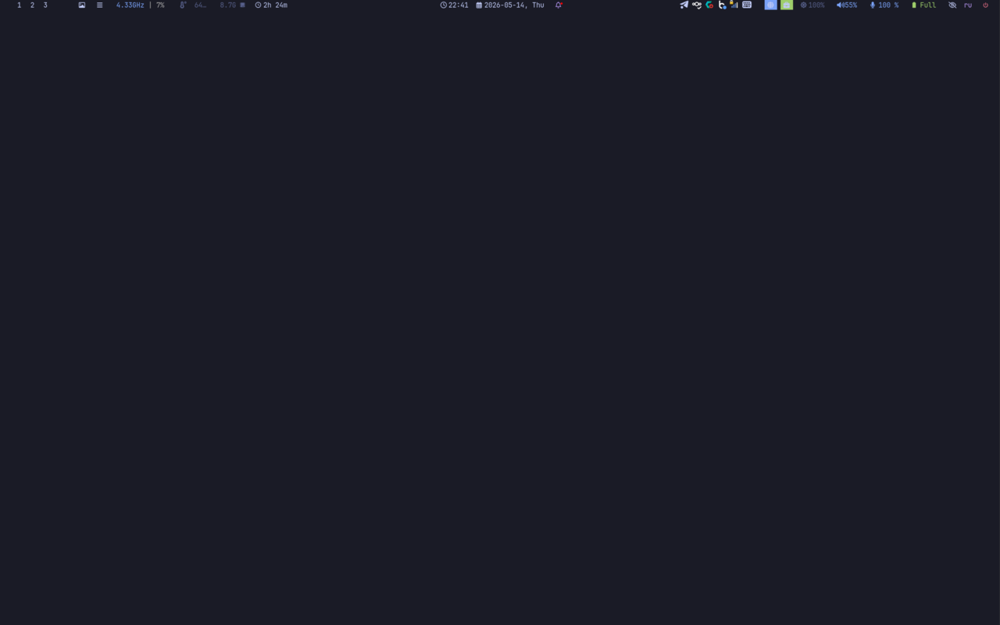 |
| `vantablack` |  |
| `violet-dusk` | 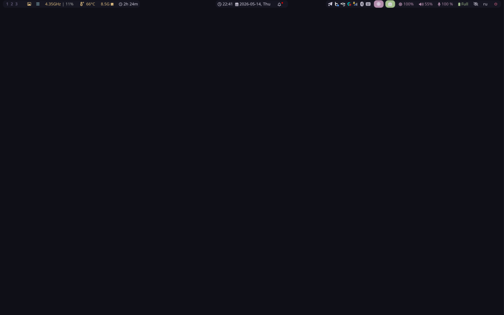 |

Generated files are ignored by Git:

```text
~/.cache/waybar/theme.css
~/.config/rofi/theme.rasi
~/.config/rofi/wallpaper-theme.rasi
~/.config/rofi/clipboard-theme.rasi
~/.config/gtk-3.0/gtk.css
~/.config/gtk-4.0/gtk.css
~/.config/swaync/style.css
~/.config/hypr/hyprlock-theme.conf
~/.config/wlogout/style.css
~/.config/wob/wob.ini
~/.config/swayosd/style.css
~/.config/alacritty/theme.toml
~/.config/kdeglobals
~/.local/share/color-schemes/Dotfiles.colors
~/.config/Code/User/dotfiles-theme.generated.json
~/.config/qt5ct/colors/dotfiles.conf
~/.config/qt6ct/colors/dotfiles.conf
~/.config/qt5ct/qt5ct.conf
~/.config/qt6ct/qt6ct.conf
~/.config/qt6ct/dotfiles.qss
~/.config/ly/theme.ini
~/.config/shell/theme.sh
```

The Waybar wallpaper button is the main theme entrypoint:

- Left click: wallpaper picker.
- Right click: theme picker.
- Middle click: random wallpaper.

## Keyboard

The XKB layout is `us,dotfiles` with the `,ru_ctrl_shortcuts` variant. Russian typing stays normal, but common `Ctrl` and `Ctrl+Shift` shortcuts resolve to the matching Latin physical keys.

Niri uses both layers:

- `Alt+Shift` switches layout at XKB level for XWayland apps.
- `Mod+Space` calls Niri `switch-layout` for Wayland-native apps.

The source files live in:

```text
.config/xkb/symbols/dotfiles
.config/xkb/rules/evdev.extras.xml
```

## Audio And Brightness

Volume and microphone controls go through one script:

```sh
~/.config/desktop/scripts/volume --get
~/.config/desktop/scripts/volume --inc
~/.config/desktop/scripts/volume --dec
~/.config/desktop/scripts/volume --toggle
~/.config/desktop/scripts/volume --toggle-mic
```

Brightness uses backlight first and DDC/CI fallback for external monitors:

```sh
~/.config/desktop/scripts/brightness --json
~/.config/desktop/scripts/brightness --inc
~/.config/desktop/scripts/brightness --dec
~/.config/desktop/scripts/brightness --cycle
```

Both scripts write to `/tmp/niri.wob` for the on-screen value display.

## Wallpaper

The wallpaper picker supports images and videos:

```text
jpg jpeg png webp gif mp4 webm mkv
```

Relevant scripts:

```text
.config/desktop/scripts/wallpaper_switcher
.config/desktop/scripts/change_wallpaper
```

Video thumbnails are generated with `ffmpeg`. Video wallpapers use `mpvpaper`; image wallpapers use `awww`.
`DOTFILES_WALLPAPER_DIR` and `DOTFILES_MPV_HWDEC` can be overridden in `~/.config/dotfiles/machine.conf`; hardware decoding is disabled by default for stability on mixed-GPU Wayland sessions.

## Lock And Idle

`hyprlock` is kept only as the screen locker. The compositor is Niri.

Session services are grouped under `dotfiles-session.target`:

```text
waybar.service
wob.service
swayosd.service
swayidle.service
clipboard-history.service
wallpaper.service
```

Idle flow:

- `swayidle` starts from Niri autostart.
- 5.5 minutes: monitors turn off through `niri msg action power-off-monitors`.
- 30 minutes: lock through `hyprlock`.
- Before sleep: lock through `hyprlock`.

Fingerprint unlock is enabled in `~/.config/hypr/hyprlock.conf` through `auth.fingerprint`. `/etc/pam.d/hyprlock` intentionally stays password-only so hyprlock does not run a second `pam_fprintd` flow in parallel with its built-in fingerprint auth. ly intentionally does not use fingerprint PAM because TTY display managers can hang or behave poorly with fingerprint prompts.

## Power

Power source changes are handled by `/etc/udev/rules.d/90-dotfiles-power-profile.rules`, which starts `dotfiles-power-profile.service`.

The service runs `/usr/local/libexec/dotfiles-power-profile`:

- On battery: `powerprofilesctl set power-saver`, PCIe ASPM `powersave`, Wi-Fi power saving on.
- On AC: `powerprofilesctl set balanced`, PCIe ASPM `default`, Wi-Fi power saving stays on.

Install the privileged pieces with:

```sh
sudo ~/.dotfiles/scripts/setup-power
```

Check the active state:

```sh
powerprofilesctl get
cat /sys/module/pcie_aspm/parameters/policy
iw dev wlan0 get power_save
```

## Calendar

A user timer mirrors the work Exchange calendar into Nextcloud via CalDAV, so
the work availability shows up outside the Outlook/Exchange client.

```text
outlook-nextcloud-sync.service  oneshot mirror (ends each run)
outlook-nextcloud-sync.timer    every 10 minutes, deferred on boot
```

Sources live in `.config/outlook-nextcloud-sync/` (`sync.py` plus committed
`config.toml.example` / `credentials.toml.example`). Real configs and the
systemd-encrypted Nextcloud password are git-ignored. Initialize with:

```sh
~/.dotfiles/scripts/setup-outlook-sync
```

The service uses `systemd-creds` (LoadCredentialEncrypted) for the Nextcloud
password and runs hardened (`ProtectSystem=strict`, `PrivateTmp`,
`NoNewPrivileges`, `UMask=0077`).

## Notes

- `DEPENDENCIES.md` lists the package set and post-install commands.
- `notes/yubikey_pool.md` documents the dynamic YubiKey/SSH signing pool.
- `notes/thinkpad_setup_process.md` keeps hardware and migration notes.
- Hyprland compositor configs, Wofi, Swaylock, legacy Waybar styles, and unused Waybar modules were removed to keep the tree focused on the active Niri desktop.
- Machine-specific knobs live in `~/.config/dotfiles/machine.conf`; keep host quirks there instead of hardcoding them into shared scripts.
